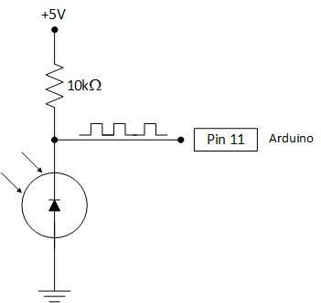
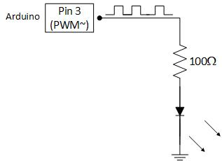

home-control-arduino
====================

Arduino projects and Python tools for my home control system.


Arduino IR Receiver
-------------------

Using this circuit: ,

and loading the [IRACreceiver](IRACreceiver) project to the Arduino,
the Arduino will print to serial raw data on received IR signals, in the form:

```
0x12345678 (32 bits)
Raw (182): -27866 3050 -3650 2100 -850 1100 -1800 1050 -800 1150 -800 2050 -850 ...
```

The HEX value is the decoded signal value,
and the raw list is a list of IR marks (positive numbers) and spaces (negative numbers) in microseconds -
as explained in the [Ken Shirriff's library page](http://www.righto.com/2009/08/multi-protocol-infrared-remote-library.html).

My A/C is controlled with an IR remote that is not supported and recognized by Ken Shirriff's library.
The [original Arduino-IRremote library](https://github.com/shirriff/Arduino-IRremote) works with up to 100 mark/space buckets,
while my A/C remote sends longer signals (around 180-190 buckets),
so I [forked the library](https://github.com/itamaro/Arduino-IRremote) in order to add support for my remote.


Arduino A/C IR Sender
---------------------

Using this circuit: ,

and loading the [IRACsender](IRACsender) project to the Arduino,
the Arduino will send (preconfigured) IR signals according to commands received via serial input.

| Command | Description
|---------|-----------------------------------------------------------------------------------------
|  `S`    | Initiate IR transmission of current state (if state not valid - print an error message)
|  `P0`   | IR signal will toggle A/C power state
|  `P1`   | IR signal will leave A/C power state as it is
|  `M0`   | Set A/C mode to Cool
|  `M1`   | Set A/C mode to Heat
|  `M2`   | Set A/C mode to Fan
|  `M3`   | Set A/C mode to Dry
|  `F0`   | Set A/C fan speed to Auto
|  `F1`   | Set A/C fan speed to Low
|  `F2`   | Set A/C fan speed to Medium
|  `F3`   | Set A/C fan speed to High
|  `T##`  | Set temperature to the 2-digit number "##"

### Feedback

The state-setting commands (P, M, F, and T) echo back with messages "\<Parameter-name\> parameter set to <new-value>"
(or "Invalid <parameter-name> value").

The IR-transmission initiation command (S) reports several status messages:
- "Error in send A/C command - not all parameters set" -- if one of the state parameters was not set to a valid value.
- "Sending A/C command with following parameters: Power=<pwr>, Mode=<mode>, Fan=<fan>, Temperature=<temp>" -- in case the state is valid, before actually transmitting anything.
- "Success" -- if IR signal was sent successfully.
- "Unsupported Command" -- if the current state is valid, but an IR signal for that state is not preconfigured.


A/C IR Analyser
---------------
